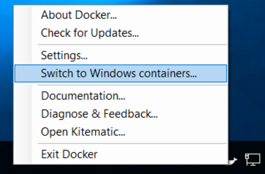

## Setting up development environment
To work/debug Windows containers you have 2 choices currently as far as OS choice is concerned. You can run it on Windows 10 or Windows 2016. Steps taken to setup development environment below were performed on Windows 10 (10.0.14393).
To prepare development environment
### Install docker
1. Download docker beta (at the time of the writing) version of docker for Windows (https://download.docker.com/win/beta/InstallDocker.msi)
2. Install docker and switch to Windows containers by right clicking on task bar icon
{:height="36px" width="36px"}
3. If everything was done properly then you shall see white whale icon in taskbar

### Install Powershell tools for docker

1. Oper Powershell prompt with administrative credentials and execute

```powershell
Register-PSRepository -Name DockerPS-Dev -SourceLocation https://ci.appveyor.com/nuget/docker-powershell-dev
Install-Module Docker -Repository DockerPS-Dev -Scope CurrentUser
```

